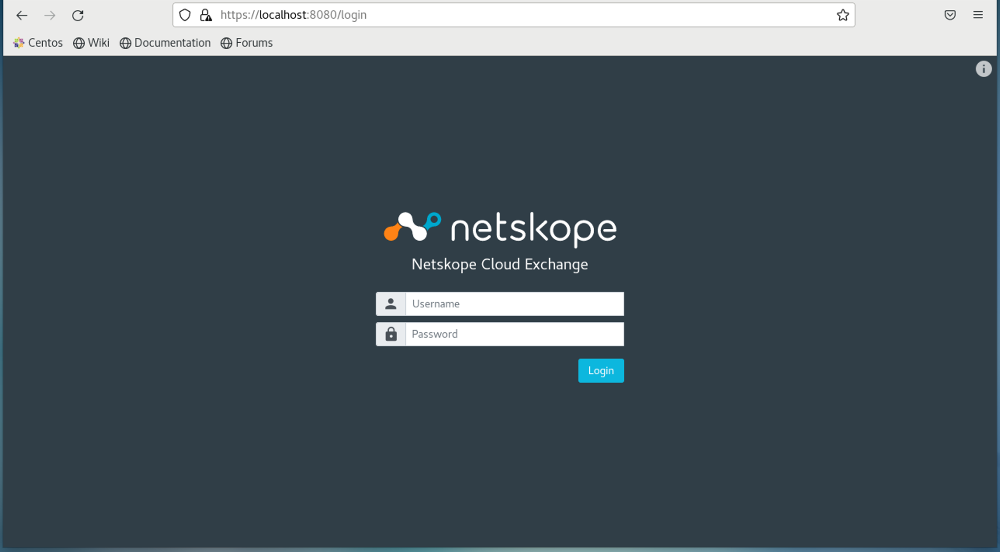

# Deploying Netskope Cloud Exchange using Helm

<div style="text-align: justify">
The Netskope Cloud Exchange (CE) provides customers with powerful integration tools to leverage investments across their security posture.

Cloud Exchange consumes valuable Netskope telemetry and external threat intelligence and risk scores, enabling improved policy implementation, automated service ticket creation, and exportation of log events from the Netskope Security Cloud.

To learn more about Netskope Cloud Exchange please refer to the [Netskope Cloud Exchange](https://www.netskope.com/products/capabilities/cloud-exchange) introduction page.
</div>

## Prerequisites 
The following prerequisites are required to deploy the Netskope Cloud Exchange using helm.
- `K8s` cluster (EKS, OpenShift, etc.) is required to deploy Netskope CE on that.
- `kubectl` must be installed on your machine.
- `helm` must be installed on your machine.
- Namespace should be created before we deploy the helm chart.
- PV provisioner support in the underlying infrastructure.
- Please refer to the section [Package Sizing Matrix](#package-sizing-matrix) before proceeding deployment. 

## Deploying the Netskope CE Helm Chart
> **FYI:** A `Release` is an instance of a chart running in a Kubernetes cluster. One chart can often be installed many times into the same cluster. And each time it is installed, a new release is created. The release name should contain lower-letters, numbers, and hyphens only.

Before installing the actual product helm chart, we have to deploy the Kubernetes operator for MongoDB and RabbitMQ.
> **Note:** If we are deploying the helm chart on the `Openshift` at that time we will have to provide privileged access to some service accounts before the deploy helm chart. We have mentioned those service account names here `mongodb-database`, `mongodb-kubernetes-operator`, `netskope-ce-rabbitmqcluster-server`, `rabbitmq-operator-rabbitmq-cluster-operator`, `rabbitmq-operator-rabbitmq-messaging-topology-operator` and the service account that you are providing (if you are not providing the service account then provide the privileged access to this `netskope-ce-serviceaccount` that we are creating by default). Skip this step if you are not on the `Openshift`.
To provide the privileged access to the above service accounts, run the below command.
```
oc adm policy add-scc-to-user privileged system:serviceaccount:netskope:<service-account-name>
```

To install MongoDB kubernetes operator: 
```
helm repo add mongodb https://mongodb.github.io/helm-charts 
helm install community-operator mongodb/community-operator -n <namespace-name>
```

To install RabbitMQ kubernetes operator:
```
helm repo add bitnami https://charts.bitnami.com/bitnami
helm install rabbitmq-operator bitnami/rabbitmq-cluster-operator -n <namespace-name>

```
To install the chart:
```bash
$ helm install <release-name> . -n <namespace-name>
```
For example, installing the chart with release name `my-release`:
```
helm install my-release . -n <namespace-name>
```
The above command deploys Netskope Cloud Exchange. The [Configurations](#configurations) section lists the parameters that can be configured during installation.

> **Tip**: List all releases using `helm list`

## Deleting the Netskope CE Helm Chart
To uninstall/delete the deployment:
```bash
helm delete <release-name> -n <namespace-name>
```
For example, uninstalling the chart with release name `my-release`:
```
helm uninstall my-release -n <namespace-name>
```
The command removes all the Kubernetes components associated with the chart and deletes the release.

## Configurations
### Common Configurations (these configurations will be applied on all pods)

| Name                     | Description                                                                                               | Default Value           | Required    |
| ------------------------ | --------------------------------------------------------------------------------------------------------- | --------------- | ----------- |
| `commonLabels`           | Add labels to all the deployed resources (sub-charts are not considered). Evaluated as a template         | `{}`            | No          | 
| `commonAnnotations`           | Common annotations to add to all resources. Evaluated as a template                                  | `{}`            | No          |
| `namespace`              | Namespace name which all resources are running in                                                         | `""`       | No          |
| `serviceAccount.create`  | Enable creation of ServiceAccount for all pods                                                            | `true`          | No          |
| `serviceAccount.name`    | Name of the created serviceAccount                                                                        | `""`            | No          |
| `serviceAccount.annotations`                  | Additional Service Account annotations                                               | `{}`            | No          |
| `serviceAccount.automountServiceAccountToken` | Allows auto mount of ServiceAccountToken on the serviceAccount created               | `false`         | No          |
| `privateImageRegistry.imagePullSecrets` | If your image registry is private, in that case, you have to pass imagePullSecrets, Secrets must be manually created in the namespace | `[]`           | No          |
| `updateStrategy`         | Strategy to use to replace existing pods                                                                 | <pre>type: <br/>RollingUpdate</pre> | No           |


### MongoDB Configurations
| Name                     | Description                                                                                               | Default Value           | Required    |
| ------------------------ | --------------------------------------------------------------------------------------------------------- | --------------- | ----------- |
| `mongodb.labels`         | Additional labels to be added to the MongoDB statefulset                                             | `{}`            | No          |
| `mongodb.annotations`    | Additional annotations to be added to the MongoDB statefulset                                             | `{}`            | No          |
| `mongodb.image`          | Docker image of MongoDB statefulset                                                                       | `index.docker.io/mongo:5.0` | No          |
| `mongodb.initContainers.volumePermissionContainer.create` | Creates init containers will use for change the mount volume permission and ownership | `false`           | No          |
| `mongodb.resources`      | Resources request and limit for MongoDB (**Note:** These are default configurations for a low data volume (Extra Small Netskope CE Package Type). The end user may want to change these values as per the underlying use case and data volume on their end (based on the associated Netskope CE Package Type). While doing that, please ensure that the underlying cluster nodes should also have a cumulative sufficient compute power for this change to work seamlessly. For more details on the Netskope CE Package Types, please refer to the [Package Sizing Matrix](#package-sizing-matrix) section)                                                                    |  <pre>limits: <br/> memory: 2Gi <br/> cpu: 1000m <br/>requests: <br> memory: 512Mi <br> cpu: 500m </pre> | No          |
| `mongodb.replicaCount`   | No. of replica of MongoDB                                                                                  | `3`             | No          |        
| `mongodb.securityContext.privileged` | Privileged containers can allow almost completely unrestricted host access                    | `false`         | No          |
| `mongodb.securityContext.allowPrivilegeEscalation` | Enable privilege escalation, it should be true if privileged is set to true.    | `false`         | No          |
| `mongodb.persistence.size` | PVC Storage Request for MongoDB data volume                                                             | `3Gi`           | No          |
| `mongodb.persistence.storageClassName` | PVC Storage Class for MongoDB data volume                                                   | `manual`        | No          |
| `mongodb.persistence.annotations` | PVC annotations                                                                                  | `{}`            | No          |
| `mongodb.auth.replicaSetKey` | Key used for authentication in the replicaset                                                         | `""`            | Yes         |
| `mongodb.auth.rootUser` | MongoDB root username                                                                                      | `""`            | Yes         |   
| `mongodb.auth.rootPassword` | MongoDB root password                                                                                  | `""`            | Yes         |
| `mongodb.auth.cteAdminUser` | MongoDB cteAdmin User          | `""`            | Yes         |
| `mongodb.auth.cteAdminPassword` | MongoDB cteAdminPassword password                                                                   | `""`            | Yes         |

### RabbitMQ Configurations
| Name                     | Description                                                                                               | Default Value           | Required    |
| ------------------------ | --------------------------------------------------------------------------------------------------------- | --------------- | ----------- |
| `rabbitmq.labels`        | Additional labels to be added to the RabbitMQ statefulset                                            | `{}`            | No          |
| `rabbitmq.annotations`    | Additional annotations to be added to the RabbitMQ statefulset                                           | `{}`            | No          |
| `rabbitmq.image`         | Docker image of RabbitMQ statefulset                                                                      | `index.docker.io/rabbitmq:3.9-management` | No          |
| `rabbitmq.replicaCount`         | No. of replica of RabbitMQ                                                                      | `3` | No          |  
| `rabbitmq.resources`     | Resources request and limit for RabbitMQ (**Note:** These are default configurations for a low data volume (Extra Small Netskope CE Package Type). The end user may want to change these values as per the underlying use case and data volume on their end (based on the associated Netskope CE Package Type). While doing that, please ensure that the underlying cluster nodes should also have a cumulative sufficient compute power for this change to work seamlessly. For more details on the Netskope CE Package Types, please refer to the [Package Sizing Matrix](#package-sizing-matrix) section)                                                                    |  <pre>limits: <br/> memory: 2Gi <br/> cpu: 1000m <br/>requests: <br> memory: 2Gi <br> cpu: 500m </pre> |  No          |       
| `rabbitmq.securityContext.privileged` | Privileged containers can allow almost completely unrestricted host access                   | `false`         | No          |
| `rabbitmq.securityContext.allowPrivilegeEscalation` | Enable privilege escalation, it should be true if privileged is set to true    | `false`         | No          |
| `rabbitmq.persistence.size` | PVC Storage Request for RabbitMQ data volume                                                           | `3Gi`           | No          |
| `rabbitmq.persistence.storageClassName` | PVC Storage Class for Rabbitmq data volume                                                 | `manual`        | No          |
| `rabbitmq.persistence.annotations` | PVC annotations                                                                                 | `{}`            | No          |
| `rabbitmq.auth.rabbitmqDefaultUser` | RabbitMQ Default User                          | `""`            | Yes         |
| `rabbitmq.auth.rabbitmqPassword` | RabbitMQ password                                                                                 | `""`            | Yes         |

### Core Configurations
| Name                     | Description                                                                                               | Default Value           | Required    |
| ------------------------ | --------------------------------------------------------------------------------------------------------- | --------------- | ----------- |
| `core.labels`            | Additional labels to be added to the Core deployment                                                 | `{}`            | No          |
| `core.annotations`       | Additional annotations to be added to the Core deployment                                                 | `{}`            | No          |
| `core.initContainers.volumePermissionContainer.create`       | Creates init containers will use for change the mount volume permission and ownership                                                 | `false`            | No          |
| `core.rbac.create`       | Whether to create & use RBAC resources or not, binding ServiceAccount to a role                           | `true`          | No          |
| `core.rbac.rules`        | Custom rules to create following the role specification                                                   | `[]`            | No          |
| `core.image`             | Docker image of Core                                                                                      | `netskopetechnicalalliances/cloudexchange:core4-latest` | No          |
| `core.replicaCount.core` | No. of replica count for Core                                                                          | `1`             | No          |
| `core.replicaCount.worker` | No. of replica count for Worker                                                                      | `0`             | No          |
| `core.proxy.enable`  | To enable proxy in Core                                                                              | `false`         | No          |
| `core.proxy.url`     | Proxy URL                                                                                            | `""`            | If `core.proxy.enable: true` |
| `core.resources`         | Resources request and limit for Core (**Note:** These are default configurations for a low data volume (Extra Small Netskope CE Package Type). The end user may want to change these values as per the underlying use case and data volume on their end (based on the associated Netskope CE Package Type). While doing that, please ensure that the underlying cluster nodes should also have a cumulative sufficient compute power for this change to work seamlessly. For more details on the Netskope CE Package Types, please refer to the [Package Sizing Matrix](#package-sizing-matrix) section)                                                                   |  <pre>limits: <br/> memory: 4Gi <br/> cpu: 4000m <br/>requests: <br> memory: 2Gi <br> cpu: 2000m </pre> | No            |            
| `core.securityContext.privileged` | Privileged containers can allow almost completely unrestricted host access                       | `false`         | No          |
| `core.securityContext.allowPrivilegeEscalation` | Enable privilege escalation, it should be true if privileged is set to true        | `false`         | No          |
| `core.persistence.size` | PVC Storage Request for Core data volume                                                           | `3Gi`           | No          |
| `core.persistence.storageClassName` | PVC Storage Class for Core data volume                                                 | `manual`        | No          |
| `core.persistence.annotations` | PVC annotations                                                                                 | `{}`            | No          |
| `core.caCertificate` | Enable the private CA certificate                                                                         | `false`            | No          |
| `core.auth.analyticsToken` | Analytics Token                                                                                         | `""`            | Yes         |
| `core.auth.jwtToken` | JWT Token                                                                                                     | `""`            | Yes         |

> Note: If the `core.caCertificate` attribute is enabled (Default: false) then the CA certificate should be present in the `ca-certificates` directory with the `ca.pem` file name.

### UI Configurations
| Name                     | Description                                                                                               | Default Value           | Required    |
| ------------------------ | --------------------------------------------------------------------------------------------------------- | --------------- | ----------- |
| `ui.labels`              | Additional labels to be added to the UI deployment                                                   | `{}`            | No          |
| `ui.annotations`         | Additional annotations to be added to the UI deployment                                                 | `{}`            | No          |
| `ui.rbac.create`         | Whether to create & use RBAC resources or not, binding ServiceAccount to a role                           | `true`          | No          |
| `ui.rbac.rules`          | Custom rules to create following the role specification                                                   | `[]`            | No          |
| `ui.image`               | Docker image of UI                                                                                        | `netskopetechnicalalliances/cloudexchange:ui4-latest` | No
| `ui.replicaCount`        | No. of replica of UI                                                                                      | `1`             | No          |
| `ui.ssl`                 | To enable SSL certificates                                                                                | `false`          | No          |
| `ui.resources`           | Resources request and limit for UI (**Note:** These are default configurations for a low data volume (Extra Small Netskope CE Package Type). The end user may want to change these values as per the underlying use case and data volume on their end (based on the associated Netskope CE Package Type). While doing that, please ensure that the underlying cluster nodes should also have a cumulative sufficient compute power for this change to work seamlessly. For more details on the Netskope CE Package Types, please refer to the [Package Sizing Matrix](#package-sizing-matrix) section)                                                                    |  <pre>limits: <br/> memory: 204Mi <br/> cpu: 750m <br/>requests: <br> memory: 102Mi <br> cpu: 250m </pre> | No           |
| `ui.securityContext.privileged` | Privileged containers can allow almost completely unrestricted host access                         | `false`         | No          |
| `ui.securityContext.allowPrivilegeEscalation` | Enable privilege escalation, it should be true if privileged is set to true.         | `false`         | No          |

> Note: If you enable `ui.ssl` certificates (Default: false), your SSL certificates and certificate & certificate private key (with the respective names `cte_cert.key` and `cte_cert_key.key`) must be present in the certificates directory at the root.

## Override the Default Values
Specify each parameter using the `--set key=value[,key=value]` argument to `helm install`. For example,

```bash
$ helm install my-release . --set mongodb.auth.rootPassword=secretpassword 
```

The above command sets the MongoDB `root` account password to `secretpassword`.

> NOTE: Once this chart is deployed, it is not possible to change the application's access credentials, such as usernames or passwords, using Helm. To change these application credentials after deployment, delete any persistent volumes (PVs) used by the chart and re-deploy it, or use the application's built-in administrative tools if available.
Alternatively, create a `values-override.yaml` YAML file that specifies the values for the parameters can be provided while installing the chart. For example,

```bash
$ helm install my-release -f sample-values-override.yaml . -n <namespace-name>
```

> **Tip**: You can refer to the default [values.yaml](values.yaml) to get a list of all the helm chart parameters that could be overridden in the override file (refer to the [sample-values-overrride.yaml](./sample-values-override.yaml)) (refer to the [sample-values-override-openshift.yaml](./sample-values-override-openshift.yaml) for the OpenShift deployment).

## Updating Deployment
To override, update the [sample-values-override.yaml](./sample-values-override.yaml) file with the required values and execute the below command.
```bash
$ helm upgrade my-release -f sample-values-override.yaml . -n <namespace-name>
```
> **Note:** There could be more values that could be needed to be overridden by the end-user based on their use case. For that, please add respective configurations in the sample-overrides- file before running the below command. The sample-override file is just for the end user's fundamental reference.
## Accessing Netskope CE
To access Netskope CE using port forward, run the below command.

```
kubectl port-forward service/<ui-service-name> 8080:80 -n <namespace-name>
```
> **Tip:** To get UI service name run this command `kubectl get svc -n <namespace-name>`.

Now, go to any browser and enter the below URL in search box.
```
https://localhost:8080/login
```



## Using Persistent Volumes
<div style="text-align: justify">
There are different types of persistent volumes that can be attached to a Kubernetes deployment. In the below section, we demonstrate the use case of persistent volumes by referencing Amazon Elastic Kubernetes Service (EKS) and Amazon Elastic File System (EFS). Please refer to the prerequisites section before jumping into the detailed steps below.
</div>
</br>

### Prerequisites
<div style="text-align: justify">
An AWS IAM Role with required permissions should be [created and configured](https://docs.aws.amazon.com/eks/latest/userguide/efs-csi.html#efs-create-iam-resources) in your Kubernetes cluster Service Account deployment YAML file to allow the Amazon EFS driver to interact with your file system.
</div>
</br>

### Step 1
[Create Amazon EFS](https://docs.aws.amazon.com/efs/latest/ug/gs-step-two-create-efs-resources.html) in AWS and get its file system ID. 

### Step 2
Install AWS EFS CSI Driver in the Kubernetes cluster (in this case Amazon EKS cluster). To install the driver, follow the below documentation.

https://github.com/kubernetes-sigs/aws-efs-csi-driver

> **Note:** Based on the current latest version of AWS EFS CSI Driver (v1.4.3), the Kubernetes version should be `>=v1.17`. Though at any point in time, the compatibility versions of Kubernetes and AWS EFS CSI Driver can be identified from the above link.

### Step 3
Create `StorageClass` in the Kubernetes deployment YAML file as mentioned below. In that StorageClass `directoryPerms` should be `700` and `gid` and `uid` should be `1001`.

```yaml
kind: StorageClass
apiVersion: storage.k8s.io/v1
metadata:
  name: <sc-name>
provisioner: efs.csi.aws.com
parameters:
  provisioningMode: efs-ap
  fileSystemId: <fs-id>
  directoryPerms: "700"
  gid: "1001"
  uid: "1001"
```

### Step 4
Pass StorageClass name (sc-name) in the `values-override.yaml` file as mentioned below in the `MongoDB` and `RabbitMQ` sections.
```yaml
mongodb:
  persistence:
    storageClassName: sc-name
rabbitmq:
  persistence:
    storageClassName: sc-name
```

### Step 5
Install the helm chart by following the steps mentioned in the above section [here](#deploying-the-netskope-ce-helm-chart).

## Package Sizing Matrix
This section depicts the required CPUs and Memory for Containers based on the Netskope Cloud Exchange Package Types depending on their use case.

| Package Type | Core Container | UI Container | MongoDB Container | RabbitMQ Container |
| ------------ | -------------- | ------------ | ----------------- | ------------------ |
| Extra Small  | <pre>limits: <br/> memory: 4Gi <br/> cpu: 4000m <br/>requests: <br> memory: 2Gi <br> cpu: 2000m </pre> | <pre>limits: <br/> memory: 204Mi <br/> cpu: 750m <br/>requests: <br> memory: 102Mi <br> cpu: 250m </pre> | <pre>limits: <br/> memory: 2Gi <br/> cpu: 1000m <br/>requests: <br> memory: 512Mi <br> cpu: 500m </pre> | <pre>limits: <br/> memory: 2Gi <br/> cpu: 1000m <br/>requests: <br> memory: 2Gi <br> cpu: 500m </pre> |
| Small        | <pre>limits: <br/> memory: 8Gi <br/> cpu: 6000m <br/>requests: <br> memory: 2Gi <br> cpu: 3000m </pre> | <pre>limits: <br/> memory: 204Mi <br/> cpu: 750m <br/>requests: <br> memory: 102Mi <br> cpu: 250m </pre> | <pre>limits: <br/> memory: 2Gi <br/> cpu: 1000m <br/>requests: <br> memory: 512Mi <br> cpu: 500m </pre> | <pre>limits: <br/> memory: 2Gi <br/> cpu: 1000m <br/>requests: <br> memory: 2Gi <br> cpu: 500m </pre> |
| Medium       | <pre>limits: <br/> memory: 16Gi <br/> cpu: 8000m <br/>requests: <br> memory: 4Gi <br> cpu: 4000m </pre> | <pre>limits: <br/> memory: 204Mi <br/> cpu: 750m <br/>requests: <br> memory: 102Mi <br> cpu: 250m </pre> | <pre>limits: <br/> memory: 2Gi <br/> cpu: 1000m <br/>requests: <br> memory: 512Mi <br> cpu: 500m </pre> | <pre>limits: <br/> memory: 2Gi <br/> cpu: 1000m <br/>requests: <br> memory: 2Gi <br> cpu: 500m </pre> |
| Large        | <pre>limits: <br/> memory: 32Gi <br/> cpu: 16000m <br/>requests: <br> memory: 8Gi <br> cpu: 4000m </pre> | <pre>limits: <br/> memory: 204Mi <br/> cpu: 750m <br/>requests: <br> memory: 102Mi <br> cpu: 250m </pre> | <pre>limits: <br/> memory: 2Gi <br/> cpu: 1000m <br/>requests: <br> memory: 512Mi <br> cpu: 500m </pre> | <pre>limits: <br/> memory: 2Gi <br/> cpu: 1000m <br/>requests: <br> memory: 2Gi <br> cpu: 500m </pre> |

Please take a look at the [sample-values-override](./sample-values-override.yaml) file that shows how to override the default values. To deploy the Helm Chart with the override file, refer to the section [Override the Default Values](#override-the-default-values).

## Testing Matrix
This section depicts the container orchestration platforms and CE version on which we have tested the current Helm chart.

| Vendor       | Service Name                                  | Container Orchestration Platform | Host OS                       | Component Versions        | Component Configurations            |
| ------------ | --------------------------------------------- | -------------------------------- | ----------------------------- | ------------------------- | ----------------------------------- |
| AWS    | Amazon Elastic Kubernetes Service (EKS)             | Kubernetes                       | amazon-eks-node-1.24-v20230127 | 1.24 EKS Version          | 3 Nodes, 16 Cores CPU and 32 GB Memory |
| Openshift    | Openshift | Openshift                       | CentOS Linux 7 (Core)          | 4.11.1 Openshift | 1 Node, 20 Cores CPU and 42 GB Memory |

| Container Name | Image Tag                                           | Version | 
| ---------------| --------------------------------------------------- | ------- |
| Core           | [netskopetechnicalalliances/cloudexchange:core4-latest](https://hub.docker.com/layers/netskopetechnicalalliances/cloudexchange/core4-latest/images/sha256-50fb52d40ab3722fb3f269afe03ff588d0b21349b4d962d64168b9465c205126?context=explore) | 4.1.0        | 
| UI           | [netskopetechnicalalliances/cloudexchange:ui4-latest](https://hub.docker.com/layers/netskopetechnicalalliances/cloudexchange/ui4-latest/images/sha256-1bddc684f34ac6d9a402c2cab41b690ecce87932e25324f34568d3f5a0119122?context=explore) | 4.1.0        | 
| MongoDB        | [index.docker.io/mongo:5.0](https://hub.docker.com/layers/library/mongo/5.0/images/sha256-a8fae999d4720fc72cc39e83c5ebfdc1602cca6701ab0569f7c1a1f3c9715c77?context=explore) | 5.0        | 
| RabbitMQ        | [index.docker.io/rabbitmq:3.9-management](https://hub.docker.com/layers/library/rabbitmq/3.9-management/images/sha256-b1685db235b7788e9145fc41d3d1e6b26516942111cb1969483aabe7ad45ba8f?context=explore) | 3.9-management | 